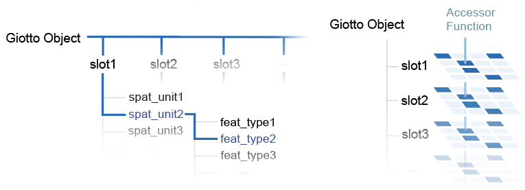
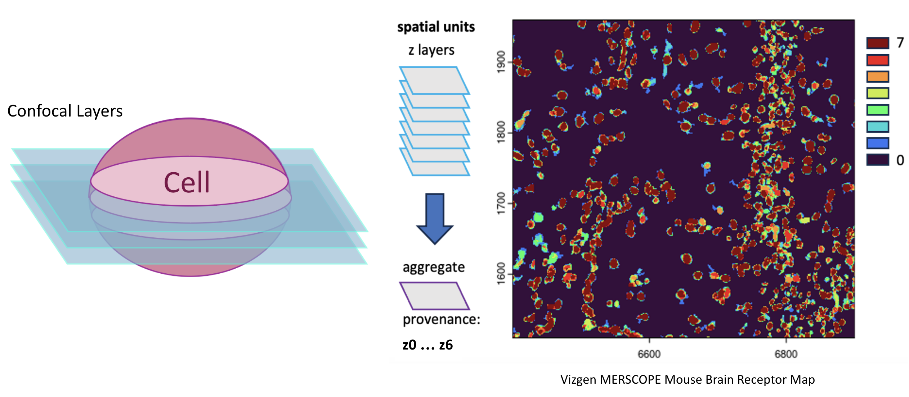

# Giotto Suite Object - A Flexible Spatial Analysis Framework
The Giotto object holds spatial-omic data and facilitates its analysis and visualization.
Central to the design of the Giotto Suite object is the concept of spatial units and feature types. Most spatial data used to be pre-aggregated, with the expression information 'belonging' to an immutable unit of study. This lent themselves to similar analysis and organization as single-cell-based analyses. With recent methods, raw feature data is now decoupled from the morphological information, opening many doors for how the data can be analyzed and combined.    

A spatial unit (**spat_unit**) is a set of polygonal information that can be used to define what you want your functional unit to be when performing analysis. This can be at different spatial sizes such as polygons that only select the nuclear region, the entire cell, or even larger tissue structures.

A feature type (**feat_type**) is which modality of feature you are analyzing such as rna or protein.    

Analyses should then be organized first by which **spat_unit** is being studied, and then by which **feat_type** is being used to understand that **spat_unit**. Giotto's updated object adopts a *nested* organization that reflects this in order to maximize flexiblity and ease of exploration.



# Setup
```{r, message=FALSE}
i_p = installed.packages()
if(!"Giotto" %in% i_p)
  devtools::install_github("drieslab/Giotto@suite")
# Ensure Giotto Data is installed
if(!"GiottoData" %in% i_p)
  devtools::install_github("drieslab/GiottoData")


library(data.table)
library(Giotto)
library(GiottoData)

# Ensure the Python environment for Giotto has been installed
genv_exists = checkGiottoEnvironment()
if(!genv_exists){
  # The following command need only be run once to install the Giotto environment
  installGiottoEnvironment()
}
```


# Creating a Giotto Object
Assembling a complete object for spatial analysis requires expression and spatial information.    
This can be provided in the form of aggregated information (expression matrices with paired spatial locations) or as raw feature data (feature detections or images) and polygonal information.  

This tutorial describes how you can assemble a Giotto object starting from subcellular data using a subset of the Vizgen MERSCOPE Mouse Brain Receptor Map data release.

## Load Data
```{r, message=FALSE}
## provide path to vizgen folder
data_path = system.file('/Mini_datasets/Vizgen/Raw/',
                        package = 'GiottoData')

## 0.1 path to transcripts ####
# --------------------------- #
## each transcript has x, y and z coordinate
tx_path = paste0(data_path, '/', 'vizgen_transcripts.gz')
tx_dt = data.table::fread(tx_path)
tx_dt = tx_dt[,.(global_x, -global_y, gene, global_z)]

## 0.2 path to cell boundaries folder ####
# -------------------------------------- #
## vizgen already provides segmentation information in .hdf5 files
## Here I have already converted the hdf5 files to a simple data.table format

boundary_path = paste0(data_path, '/cell_boundaries/')

z0_polygon_DT = fread(paste0(boundary_path, '/', 'z0_polygons.gz'))
z1_polygon_DT = fread(paste0(boundary_path, '/', 'z1_polygons.gz'))

## 0.3 path to images ####
# ---------------------- #
DAPI_z0_image_path = paste0(data_path, '/', 'images/mini_dataset_dapi_z0.jpg')
DAPI_z1_image_path = paste0(data_path, '/', 'images/mini_dataset_dapi_z1.jpg')
```


## New Object Types

### giottoPolygon
```{r, message=FALSE}
# giottoPolygon creation from data.table
z0_polygons = createGiottoPolygonsFromDfr(name = 'z0',
                                          segmdfr = z0_polygon_DT)
z1_polygons = createGiottoPolygonsFromDfr(name = 'z1',
                                          segmdfr = z1_polygon_DT)

z0_polygons
plot(z0_polygons)
```

### giottoPoints
```{r, message=FALSE}
# giottoPoints creation from data.table
tx = createGiottoPoints(tx_dt, feat_type = 'rna')

tx
plot(tx)
```

### giottoLargeImage
```{r}
ultra_mini_extent = ext(c(6400.029, 6900.037, -5150.007, -4699.967 ))
image_paths = c(DAPI_z0_image_path, DAPI_z1_image_path)
image_names = c('dapi_z0', 'dapi_z1')

imagelist = createGiottoLargeImageList(raster_objects = image_paths,
                                       names = image_names,
                                       extent = ultra_mini_extent)

imagelist[[1]]
```
```{r, results='hide'}
plot(imagelist[[1]])
```

## Object Creation
Giotto objects are created through a call to `createGiottoObject()`. Inputs to to this function should be supplied as named lists of data where the names are used to determine the data nesting they should be assigned as.
```{r, message=FALSE}
viz = createGiottoObject(feat_info = list('rna' = tx_dt),
                         spatial_info = list('z0' = z0_polygons))
instructions(viz, 'return_plot') = FALSE # set instructions to prevent returning of plots
```

# Subcellular Workflow
The next steps walk through the usual method of processing a Giotto object that has been assembled using subcellular information

## Add Spatial Locations
Generate centroids to use as convenient spatial representations of where your cells are. This information gets stored in the `@spatial_locs` slot
```{r, message=FALSE}
viz = addSpatialCentroidLocations(gobject = viz,
                                  poly_info = 'z0',
                                  return_gobject = TRUE)
# visualize
spatPlot2D(viz)
```

## Add Images
```{r, message=FALSE}
viz = addGiottoImage(viz, largeImages = imagelist[1])
```
```{r, echo=FALSE}
spatInSituPlotPoints(viz,
                     show_image = TRUE,
                     largeImage_name = 'dapi_z0',
                     show_polygon = TRUE,
                     polygon_feat_type = 'z0',
                     polygon_color = 'cyan',
                     polygon_line_size = 0.2,
                     polygon_alpha = 0.4)
```

## Aggregate Expression Matrix
Using the polygonal information, sum up all of the transcript point detections that fall within. This is can then be used as an expression count matrix. This information is then stored in the `@expression` slot.
```{r, results='hide'}
# Calculate transcripts in 'rna' overlapped
# by the specified polygons in 'z0' (aggregation)
viz = calculateOverlapRaster(viz,
                             spatial_info = 'z0',
                             feat_info = 'rna')

# Send overlaps information to the expression slot as a new expression matrix
# of spat_unit 'z0' and feat_type 'rna' with a name of 'raw'
viz = overlapToMatrix(viz,
                      poly_info = 'z0',
                      feat_info = 'rna',
                      name = 'raw')
```


```{r, echo=FALSE}
viz = addStatistics(viz, expression_values = 'raw')
spatInSituPlotPoints(viz,
                     show_polygon = TRUE,
                     polygon_feat_type = 'z0',
                     polygon_fill_as_factor = FALSE,
                     polygon_fill = 'total_expr',
                     polygon_line_size = 0.2,
                     polygon_alpha = 1)
```

From here on, the normal aggregate type analyses can continue.


## Exploring the Object
We have added several objects to the Giotto object now. Directly returning the object gives a summary of what information is contained within.    
For a more detailed look at a specific slot and type of data, Giotto has several `show` functions.
```{r}
# Returning the object provides a summary
viz

# Closer look at @expression slot contents
showGiottoExpression(viz)
```


# Multiple Z-Stacks and Spatial Unit Provenance


What about when the data is presented as multiple confocal z-stacks? The Vizgen MERSCOPE Mouse Brain Receptor Map dataset is actually one such example, with 7 layers of different polygons alongside matching transcript detections at each Z layer. This data should not be treated as fully 3D since the z-layers are close enough together that they sample multiple times from each individual cell as opposed to entirely different cells in a different z layer.    
This problem illustrates another way in which **spat_unit** can be used in Giotto. Giotto handles this by defining each z-layer as its own **spat_unit** and then performing separate aggregations at each z-layer. These **spat_unit**s are then merged them into a single combined **spat_unit** for analysis.    
Since the resulting combined **spat_unit** is different depending on which layers were used, that information is tracked as **provenance**.    

## Remake Giotto Object
In light of this, let's remake our object.
```{r, message=FALSE}
# create with 2 spatial units
viz = createGiottoObject(feat_info = list('rna' = tx),
                         spatial_info = list('z0' = z0_polygons,
                                             'z1' = z1_polygons))
instructions(viz, 'return_plot') = FALSE # set instructions to prevent returning of plots

# generate spatial locations
viz = addSpatialCentroidLocations(gobject = viz,
                                  poly_info = paste0('z',0:1),
                                  provenance = list('z0', 'z1'),
                                  return_gobject = TRUE)
```

## Redo Aggregation
### Layer-Specific Aggregations
```{r, results='hide'}
viz = calculateOverlapRaster(viz,
                             spatial_info = 'z0',
                             feat_info = 'rna',
                             feat_subset_column = 'global_z',
                             feat_subset_ids = 0)

viz = overlapToMatrix(viz,
                      poly_info = 'z0',
                      feat_info = 'rna',
                      name = 'raw')

viz = calculateOverlapRaster(viz,
                             spatial_info = 'z1',
                             feat_info = 'rna',
                             feat_subset_column = 'global_z',
                             feat_subset_ids = 1)

viz = overlapToMatrix(viz,
                      poly_info = 'z1',
                      feat_info = 'rna',
                      name = 'raw')
```


### Collapse Into Common 'aggregate' spat_unit
```{r, results='hide', message=FALSE}
# combine the calculated data for z1 and z0 into a new spatial unit called
# 'aggregate'
viz = aggregateStacks(gobject = viz,
                      spat_units = c('z0', 'z1'),
                      feat_type = 'rna',
                      values = 'raw',
                      summarize_expression = 'sum',
                      summarize_locations = 'mean',
                      new_spat_unit = 'aggregate')
```

```{r, echo=FALSE}
# set the active spat_unit to 'aggregate' to have it be the default from now on
activeSpatUnit(viz) = 'aggregate'
viz = addStatistics(viz, expression_values = 'raw')
spatInSituPlotPoints(viz,
                     show_polygon = TRUE,
                     polygon_feat_type = 'aggregate',
                     polygon_fill_as_factor = FALSE,
                     polygon_fill = 'total_expr',
                     polygon_line_size = 0.2,
                     polygon_alpha = 1)
```

From here the usual aggregate analyses can be performed after filtering and normalization
```{r, results='hide'}
viz = filterGiotto(viz,
                   expression_threshold = 1,
                   feat_det_in_min_cells = 1,
                   min_det_feats_per_cell = 1)
viz = normalizeGiotto(viz)
```

```{r}
# You can see that there are now z0, z1, and 'aggregate' as sets of spatial units
viz
showGiottoExpression(viz)
```


# Autocorrelation
Giotto Suite also now includes geospatial statistics and can perform global and local spatial autocorrelation

## Global Statistics
```{r}
viz = createSpatialNetwork(viz,
                           method = 'kNN',
                           name = 'kNN_network',
                           k = 8)

# returns as a data.table of results
res = spatialAutoCorGlobal(
  viz,
  method = 'moran',
  spatial_network_to_use = 'kNN_network',
  data_to_use = 'expression',
  expression_values = 'normalized'
)

print((res))
print(res[moran == max(moran)])
```

## Local Statistics
```{r}
# local autocorrelation results are returned as a set of spatial enrichment data and saved in the giotto object
viz = spatialAutoCorLocal(viz,
                          method = 'moran',
                          data_to_use = 'expression',
                          expression_values = 'normalized')

# local moran's I of the most autocorrelated gene according to the global results
spatPlot2D(viz,
           spat_enr_names = 'expr_moran',
           cell_color = res[moran == max(moran), feat_ID],
           color_as_factor = FALSE)
```

# Generate Polygons
```{r, message=FALSE}
tx = getFeatureInfo(viz, feat_type = 'rna', return_giottoPoints = TRUE)
e = ext(tx) # get extent (spatial bounding box)

hexbin = tessellate(e, shape = 'hexagon', radius = 10, name = 'hexbin')
viz = setPolygonInfo(viz, hexbin)

pseudo_vis = makePseudoVisium(e)
viz = setPolygonInfo(viz, pseudo_vis, name = 'pseudo_visium')

viz = spatQueryGiottoPolygons(viz,
                              filters = list(pseudo_visium = 'all',
                                             hexbin = 'all'))

plot(hexbin)
plot(pseudo_vis)
plot(viz@spatial_info$query_poly)
```

# GiottoData Package
GiottoData is a set of mini Giotto objects that are already put together and have some analyses run on them. These were created as spatial subsets of the full data making them more portable and easy to manipulate.
```{r, eval=FALSE}
mini_viz = GiottoData::loadGiottoMini('vizgen')
mini_viz
```

# Session Info
```{r}
sessionInfo()
```

