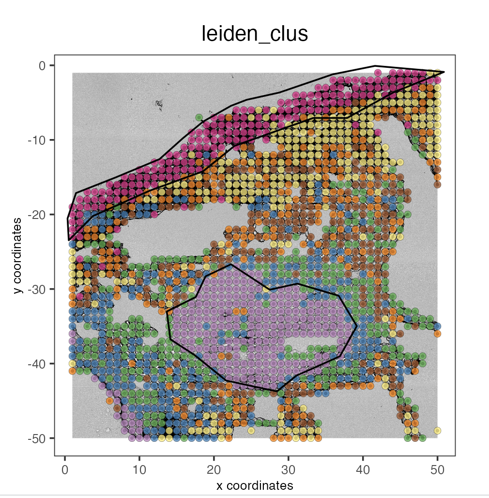

# Data

To run this vignette, we will use the Skin dataset from the article [High-plex protein and whole transcriptome co-mapping at cellular resolution with spatial CITE-seq](https://www.nature.com/articles/s41587-023-01676-0)

# Installation

To run this vignette, you must download the last version of Giotto Suite

```{r, eval=FALSE}
remotes::install_github("drieslab/Giotto@suite_dev")
```

# Individual modalities preparation

## Create Giotto object

Load Giotto 

```{r}
library(Giotto)
```

```{r, message=FALSE, warning=FALSE}
instrs <- createGiottoInstructions(save_plot = FALSE,
                                   show_plot = FALSE)
```

Create Giotto object using RNA and Protein expression, as well as spatial positions.

```{r, message=FALSE, warning=FALSE}
my_giotto_object <- createGiottoObject(
  expression = list(rna = list(raw = "data/expression_rna.csv"),
                    protein = list(raw = "data/expression_protein.csv")),
  expression_feat = list("rna", "protein"),
  spatial_locs = "data/positions.csv",
  instructions = instrs)

```


## Add tissue image

```{r, message=FALSE, warning=FALSE}
my_giotto_image <- createGiottoImage(gobject = my_giotto_object,
                                     do_manual_adj = TRUE,
                                     scale_factor = 0.0625,
                                     mg_object = "data/skin.jpg",
                                     negative_y = TRUE)

my_giotto_object <- addGiottoImage(gobject = my_giotto_object,
                                   images = list(my_giotto_image),
                                   spat_loc_name = "raw")
```

Visualize image

```{r, fig.align='center'}
spatPlot2D(my_giotto_object,
         show_image = TRUE,
         point_size = 2)
```

## RNA modality 

### Filtering

```{r, warning=FALSE}
my_giotto_object <- filterGiotto(gobject = my_giotto_object,
                                 spat_unit = "cell",
                                 feat_type = "rna",
                                 expression_threshold = 1,
                                 feat_det_in_min_cells = 1,
                                 min_det_feats_per_cell = 1)
```

### Normalization

```{r}
my_giotto_object <- normalizeGiotto(gobject = my_giotto_object,
                                    spat_unit = "cell",
                                    feat_type = "rna",
                                    norm_methods = "standard",
                                    scalefactor = 10000,
                                    verbose = TRUE)
```

### Gene statistics

```{r}
my_giotto_object <- addStatistics(gobject = my_giotto_object,
                                  spat_unit = "cell",
                                  feat_type = "rna")
```

### HVF identification

```{r}
my_giotto_object <- calculateHVF(gobject = my_giotto_object,
                                 spat_unit = "cell",
                                 feat_type = "rna",
                                 expression_values = "normalized",
                                 method = "cov_groups",
                                 nr_expression_groups = 20,
                                 zscore_threshold = 1.5)
```

### Principal component analysis (PCA)

```{r}
my_giotto_object <- runPCA(gobject = my_giotto_object,
                           spat_unit = "cell",
                           feat_type = "rna",
                           expression_values = "normalized",
                           reduction = "cells",
                           feats_to_use = "hvf",
                           name = "rna.pca")
```

### Uniform manifold approximation projection (UMAP)

```{r}
my_giotto_object <- runUMAP(gobject = my_giotto_object,
                            spat_unit = "cell",
                            feat_type = "rna",
                            expression_values = "normalized",
                            reduction = "cells",
                            dimensions_to_use = 1:10,
                            dim_reduction_name = "rna.pca")
```

### Create nearest network

```{r}
my_giotto_object <- createNearestNetwork(gobject = my_giotto_object,
                                         spat_unit = "cell",
                                         feat_type = "rna",
                                         type = "kNN",
                                         dim_reduction_name = "rna.pca",
                                         name = "rna_kNN.pca",
                                         dimensions_to_use = 1:10,
                                         k = 20)
```

### Find Leiden clusters

```{r}
my_giotto_object <- doLeidenCluster(gobject = my_giotto_object,
                                    spat_unit = "cell",
                                    feat_type = "rna",
                                    nn_network_to_use = "kNN",
                                    network_name = "rna_kNN.pca",
                                    name = "leiden_clus")
```

### Plot PCA

```{r, out.width='50%', fig.align='center'}
plotPCA(gobject = my_giotto_object,
        spat_unit = "cell",
        feat_type = "rna",
        dim_reduction_name = "rna.pca",
        cell_color = 'leiden_clus',
        title = "RNA PCA")
```

### Plot UMAP

```{r, out.width='50%', fig.align='center'}
plotUMAP(gobject = my_giotto_object,
         spat_unit = "cell",
         feat_type = "rna",
         cell_color = 'leiden_clus',
         point_size = 2,
         title = "RNA Uniform Manifold Approximation & Projection (UMAP)",
         axis_title = 12,
         axis_text = 10)
```

### Plot spatial locations by cluster

```{r, fig.align='center'}
spatPlot2D(my_giotto_object,
           show_image = TRUE,
           point_size = 1.5,
           cell_color = "leiden_clus",
           title = "RNA Leiden clustering")
```


## Protein modality 

### Filtering

```{r, warning=FALSE}
my_giotto_object <- filterGiotto(gobject = my_giotto_object,
                                 spat_unit = "cell",
                                 feat_type = "protein",
                                 expression_threshold = 1,
                                 feat_det_in_min_cells = 1,
                                 min_det_feats_per_cell = 1)
```

### Normalization

```{r, warning=FALSE}
my_giotto_object <- normalizeGiotto(gobject = my_giotto_object,
                                    spat_unit = "cell",
                                    feat_type = "protein",
                                    scalefactor = 10000,
                                    verbose = T)
```

### Gene statistics

```{r}
my_giotto_object <- addStatistics(gobject = my_giotto_object,
                                  spat_unit = "cell",
                                  feat_type = "protein",
                                  expression_values = "normalized")
```

### Principal component analysis (PCA)

```{r}
my_giotto_object <- runPCA(gobject = my_giotto_object,
                           spat_unit = "cell",
                           feat_type = "protein",
                           expression_values = "normalized",
                           scale_unit = T,
                           center = F,
                           method = "factominer")
```

### Uniform manifold approximation projection (UMAP)

```{r}
my_giotto_object <- runUMAP(gobject = my_giotto_object,
                            spat_unit = "cell",
                            feat_type = "protein",
                            expression_values = "normalized",
                            dimensions_to_use = 1:10)
```

### Create nearest network

```{r}
my_giotto_object <- createNearestNetwork(gobject = my_giotto_object,
                                         spat_unit = "cell",
                                         feat_type = "protein",
                                         type = "kNN",
                                         name = "protein_kNN.pca",
                                         dimensions_to_use = 1:10,
                                         k = 20)
```

### Find Leiden clusters

```{r}
my_giotto_object <- doLeidenCluster(gobject = my_giotto_object,
                                    spat_unit = "cell",
                                    feat_type = "protein",
                                    nn_network_to_use = "kNN",
                                    network_name = "protein_kNN.pca",
                                    name = "leiden_clus")
```

### Plot PCA

```{r, out.width='50%', fig.align='center'}
plotPCA(gobject = my_giotto_object,
        spat_unit = "cell",
        feat_type = "protein",
        dim_reduction_name = "protein.pca",
        cell_color = 'leiden_clus',
        title = "Protein PCA")
```

### Plot UMAP

```{r, out.width='50%', fig.align='center'}
plotUMAP(gobject = my_giotto_object,
         spat_unit = "cell",
         feat_type = "protein",
         cell_color = 'leiden_clus',
         dim_reduction_name = "protein.umap",
         point_size = 2,
         title = "Protein Uniform Manifold Approximation & Projection (UMAP)",
         axis_title = 12,
         axis_text = 10)
```

### Plot spatial locations by cluster

```{r, fig.align='center'}
spatPlot2D(my_giotto_object,
           spat_unit = "cell",
           feat_type = "protein",
           cell_color = "leiden_clus",
           point_size = 1.5,
           show_image = TRUE,
           title = "Protein Leiden clustering")
```

## Save Giotto object
```{r, eval=FALSE}
saveGiotto(my_giotto_object, "multiomics_Giotto_object")
```

# Multi-omics integration

## Load Giotto object

Download the file from https://drive.google.com/file/d/1GyhKWl14MxEJCw_2-e8Bge3d3zY7XLkc/view?usp=share_link

```{r, eval=FALSE}
my_giotto_object <- loadGiotto("multiomics_Giotto_object")
```


## Calculate WNN

```{r}
my_giotto_object <- runWNN(my_giotto_object,
                           modality_1 = "rna",
                           modality_2 = "protein",
                           pca_name_modality_1 = "rna.pca",
                           pca_name_modality_2 = "protein.pca",
                           k = 20,
                           verbose = TRUE)
```

## Create integrated UMAP

```{r}
my_giotto_object <- runIntegratedUMAP(my_giotto_object,
                                      modality1 = "rna",
                                      modality2 = "protein",
                                      spread = 5,
                                      min_dist = 2)
```

## Calculate Leiden clusters
```{r}
my_giotto_object <- doLeidenCluster(gobject = my_giotto_object,
                                    spat_unit = "cell",
                                    feat_type = "rna",
                                    nn_network_to_use = "kNN",
                                    network_name = "integrated_kNN",
                                    name = "integrated_leiden_clus",
                                    resolution = 0.4)
```

## Plot integrated UMAP

```{r, out.width='50%', fig.align='center'}
plotUMAP(gobject = my_giotto_object,
         spat_unit = "cell",
         feat_type = "rna",
         cell_color = 'integrated_leiden_clus',
         dim_reduction_name = "integrated.umap",
         point_size = 1.5,
         title = "Integrated UMAP using Integrated Leiden clusters",
         axis_title = 12,
         axis_text = 10)
```

## Plot integrated spatial locations by cluster

```{r, fig.align='center'}
spatPlot2D(my_giotto_object,
           spat_unit = "cell",
           feat_type = "rna",
           cell_color = "integrated_leiden_clus",
           point_size = 1.5,
           show_image = TRUE,
           title = "Integrated Leiden clustering")
```

# Interactive selection

## Add tissue image

```{r, eval=FALSE}
my_giotto_image <- createGiottoImage(gobject = my_giotto_object,
                                     do_manual_adj = TRUE,
                                     scale_factor = 0.0625,
                                     mg_object = "data/skin.jpg",
                                     negative_y = TRUE)

my_giotto_object <- addGiottoImage(gobject = my_giotto_object,
                                   images = list(my_giotto_image),
                                   spat_loc_name = "raw")
```


The interactive selection tool will allow you to run a Shiny app and plot polygons over the tissue.

Note that you can use the blue bars to Zoom in/out at areas of interest over the tissue

You can choose multiple polygon names, one for each drawn polygon. 

When you have finished plotting polygons, click on the Done button

my_polygon_coordinates will store a data.table object with the polygon names and xy coordinates for downstream analysis.

## Create a spatial plot

```{r, fig.align='center'}
my_spatPlot <- spatPlot2D(gobject = my_giotto_object,
                          spat_unit = "cell",
                          feat_type = "protein",
                          show_image = TRUE,
                          cell_color = 'leiden_clus',
                          point_size = 2,
                          point_alpha = 0.75)

my_spatPlot
```

## Run interactive tool

```{r, eval=FALSE}
my_polygon_coordinates <- plotInteractivePolygons(my_spatPlot, color = "black")
```

```{r,echo=FALSE, out.width='70%', fig.align='center'}
my_polygon_coordinates <- readRDS("my_polygon_coordinates.RDS")

```

## Add polygons information to Giotto object

```{r}
my_giotto_polygons <- createGiottoPolygonsFromDfr(my_polygon_coordinates, 
                                                  name = 'selections')

my_giotto_object <- addGiottoPolygons(gobject = my_giotto_object, 
                                      gpolygons = list(my_giotto_polygons))
```

addPolygonCells will modify the cell_metadata slot to indicate if a certain cell is located within a polygon area (polygon1,2,3..) or not (no_polygon)

```{r}
my_giotto_object <- addPolygonCells(my_giotto_object, 
                                    polygon_name = 'selections')
```

Verify that cell metadata has been modified

```{r}
head(pDataDT(my_giotto_object))
```

## Retrieve cells from the polygon area

my_polygons_cells is a terra::spatVector object that contains the information of each cell within the polygon areas

```{r}
my_polygons_cells <- getCellsFromPolygon(my_giotto_object, 
                                         polygon_name = 'selections')
my_polygons_cells
```


## Differential Expression between selected regions

Find marker features for each polygon

```{r}
scran_results <- findMarkers_one_vs_all(my_giotto_object,
                                        spat_unit = "cell",
                                        feat_type = "rna",
                                        method = "scran",
                                        expression_values = "normalized",
                                        cluster_column = "selections",
                                        min_feats = 10)

top_genes <- scran_results[, head(.SD, 2), by = 'cluster']$feats
```

comparePolygonExpression will create a heatmap to observe the differential expression between polygon areas

```{r, out.width='50%', fig.align='center'}
comparePolygonExpression(my_giotto_object,
                         selected_feats = "top_genes")
```

You can isolate each region to plot cell metadata such as the number of features per cell.

```{r, fig.align='center', warning=FALSE, message=FALSE}
spatPlot2D(my_giotto_object,
           cell_color = 'nr_feats',
           group_by = 'selections',
           color_as_factor = FALSE,
           point_size = 2,
           coord_fix_ratio = 1,
           cow_n_col = 2,
           show_legend = TRUE)
```

Or plot gene expression per cell by selected region (polygon).

```{r, out.width='90%', fig.align='center', warning=FALSE, message=FALSE}
spatFeatPlot2D(my_giotto_object, 
               expression_values = 'scaled',
               feats = c("APOC1", "TMEM132D"), 
               group_by = 'selections',
               point_size = 2)
```


## Cell types enriched between selected regions

You can compare the percent of cell types by selected region (polygon).

```{r, out.width='50%', fig.align='center'}
compareCellAbundance(my_giotto_object,
                     spat_unit = "cell",
                     feat_type = "rna")
```

You can isolate each region and plot cell types

```{r,echo=FALSE}
x <- pDataDT(my_giotto_object, spat_unit = "cell", feat_type = "rna")
x[,c('cell_ID', 'selections')]
my_giotto_object <- addCellMetadata(my_giotto_object, 
                                    spat_unit = "cell", 
                                    feat_type = "protein", 
                                    new_metadata = x[,c('integrated_leiden_clus','selections')])
```

```{r, fig.align='center', warning=FALSE, message=FALSE}
spatPlot2D(my_giotto_object,
           spat_unit = "cell",
           feat_type = "protein",
           cell_color = 'integrated_leiden_clus',
           group_by = 'selections',
           color_as_factor = TRUE,
           point_size = 1,
           coord_fix_ratio = 1,
           cow_n_col = 2,
           show_legend = TRUE)
```

## Plot polygons again

Finally, you can plot the regions previously selected.

```{r, fig.align='center'}
plotPolygons(my_giotto_object,
             x = my_spatPlot,
             polygon_name = 'selections')
```

